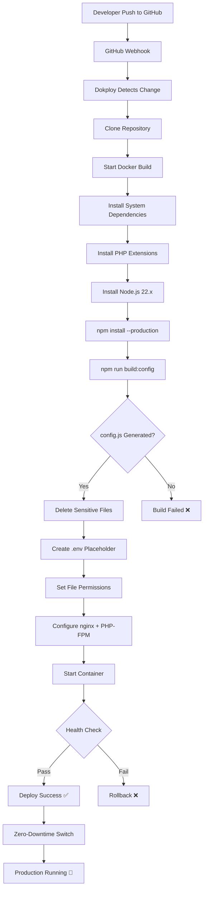
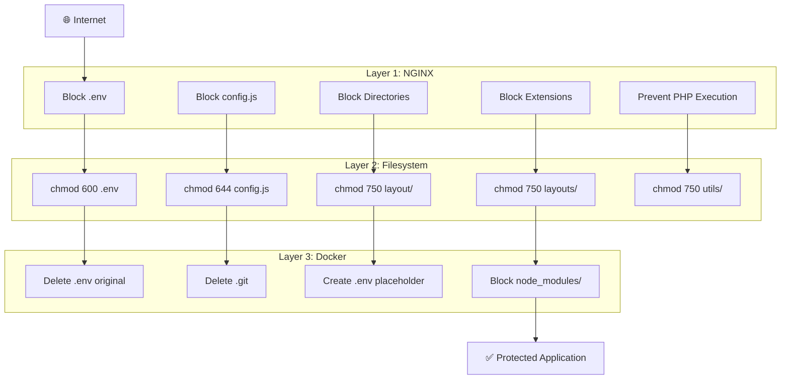
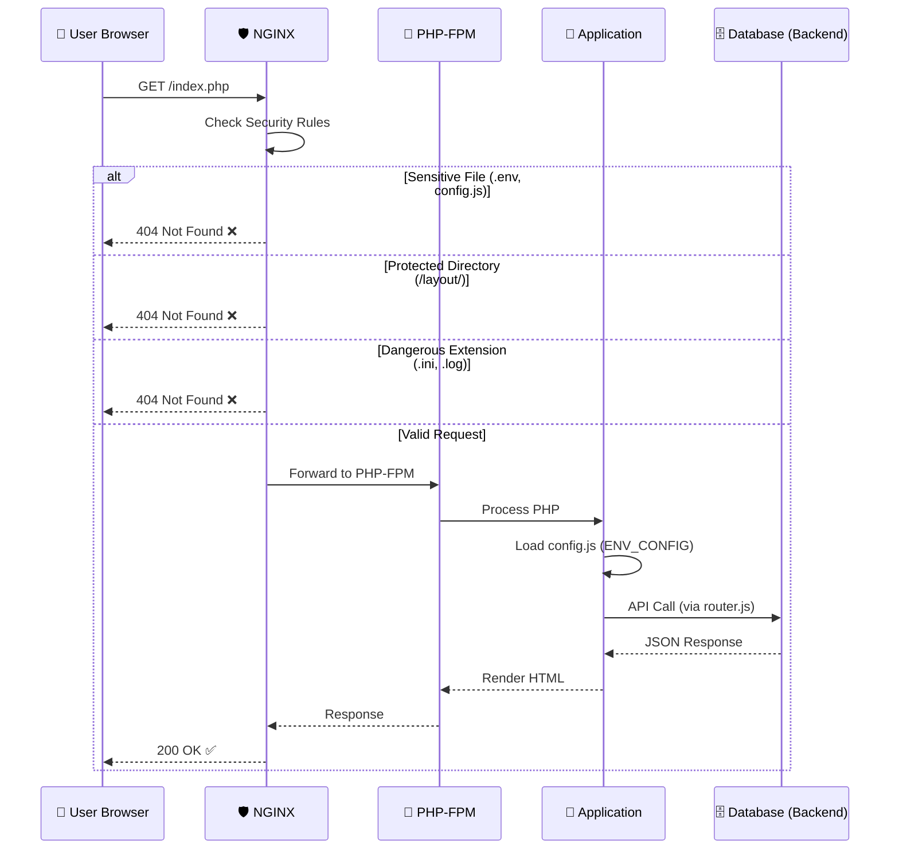
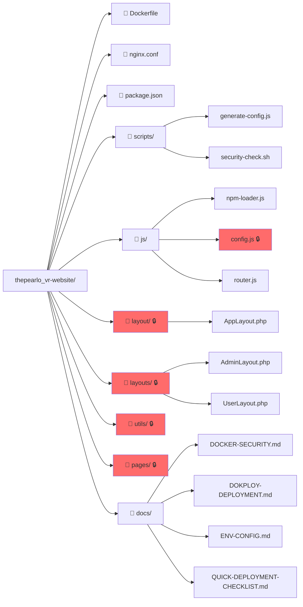
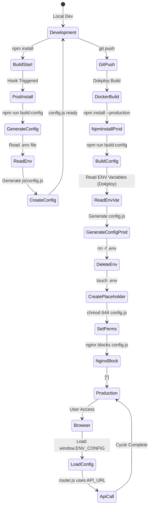
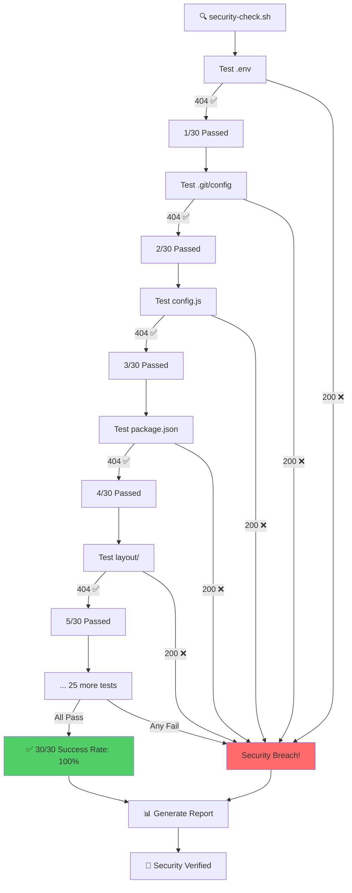
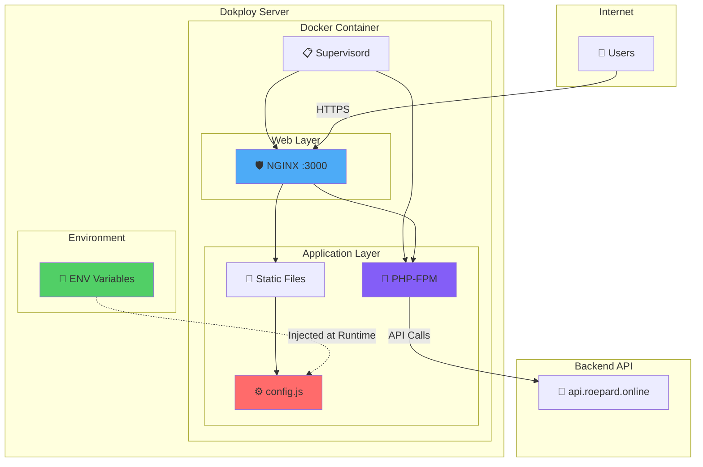
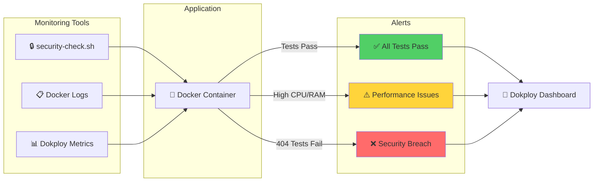
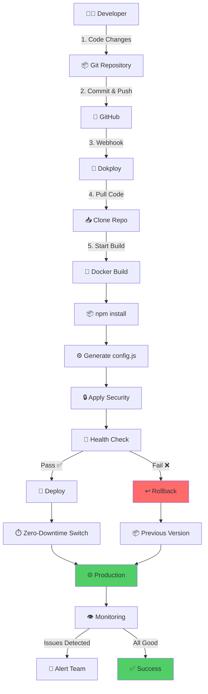

# 🏗️ Arquitectura de Seguridad - HomeLab Frontend

## 📊 Diagrama de Flujo - Deployment Pipeline

---

## 🔒 Diagrama de Capas de Seguridad

---

## 🚀 Diagrama de Flujo de Request HTTP

---

## 📦 Diagrama de Estructura de Archivos

---

## 🔄 Diagrama de Ciclo de Vida de config.js

---

## 🎯 Diagrama de Tests de Seguridad

---

## 🏭 Diagrama de Arquitectura de Producción

---

## 📈 Diagrama de Monitoreo

---

## 🔄 Diagrama de CI/CD Pipeline

---

## 📝 Leyenda de Íconos

- 🌐 **Internet/Users** - Tráfico público
- 🛡️ **NGINX** - Servidor web con seguridad
- 🐘 **PHP-FPM** - Procesador PHP
- 🐳 **Docker** - Contenedor
- 🔒 **Protected** - Archivos/directorios protegidos
- 🔐 **Environment** - Variables de entorno
- ✅ **Success** - Operación exitosa
- ❌ **Fail** - Operación fallida
- ⚠️ **Warning** - Advertencia
- 🚀 **Deploy** - Deployment en progreso
- 👁️ **Monitor** - Monitoreo activo
- 📊 **Metrics** - Métricas y estadísticas

---

*Arquitectura documentada visualmente - HomeLab VR Frontend*
*Generado el 02/01/2025*
